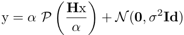
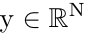
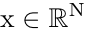
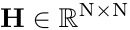
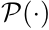
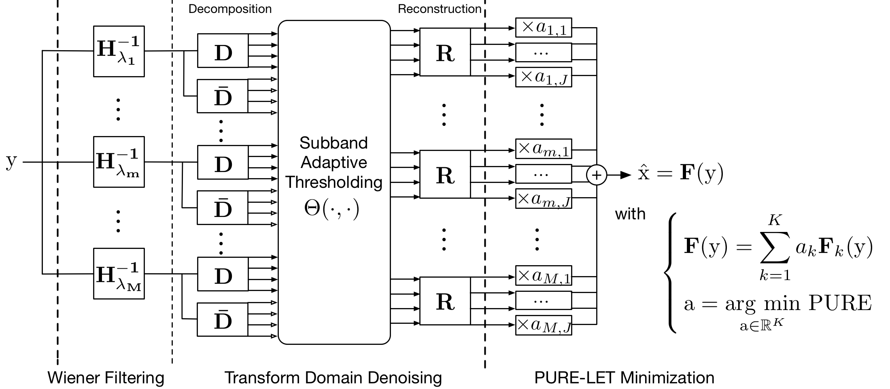
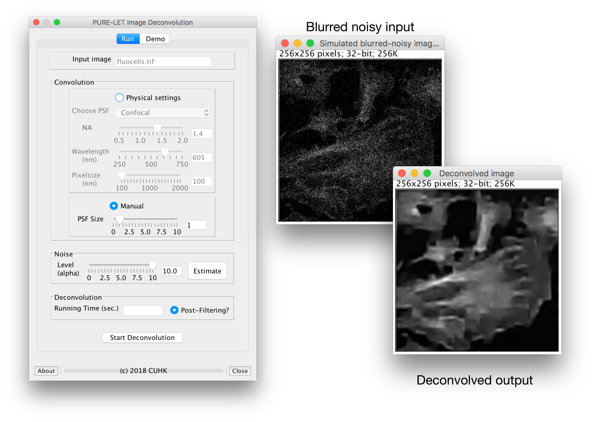

 # PURE-LET Image Deconvolution
 Jizhou Li, Florian Luisier and Thierry Blu
 
 ---
 In a variety of applications, ranging from astronomical imaging to biological microscopy, the predominant source of noise follows a Poisson distribution due to the quantum nature of the photon-counting process at the detectors. The observation model for a linear degradation caused by blurring and Poisson noise (and possibly additive Gaussian noise) is given by

 

 where  denotes the distorted observation of the unknown true image .  implements a convolution of the point spread function.  represents the effect of Poisson noise. 

 Our approach is to approximate the deconvolution process as a linear combination of elementary processings of the image, termed "linear expansion of thresholds (LET)" whose coefficients are obtained by minimizing a quadratic criterion (the Poisson unbiased risk estimate - PURE). Each elementary processing consists of Wiener filtering followed by adaptive thresholding in wavelet domain. The principle is shown as follows:

Typically three different Wiener filters are used, with regularization parameters fixed once for all.

#### Advantages of the proposed approach:

- Non-iterative and thus has an explicit solution.
- Low computational complexity since it boils down to solving a small linear system of equations.
- Very robust to a wide range of noise level.
- No parameter tuning. 

### References
- [1] Li, J., Luisier, F., & Blu, T.,"PURE-LET image deconvolution", IEEE Transactions on Image Processing, Vol. 27 (1), pp. 92–105, January 2018.
- [2] Li, J., Luisier, F., & Blu, T.,"PURE-LET deconvolution of 3D fluorescence microscopy images", Proceedings of the Fourteenth IEEE International Symposium on Biomedical Imaging (ISBI'17), Melbourne, Australia, pp. 723–727, April 18–21, 2017. _Best student paper award (2nd place)_.
- [3] Li, J., Luisier, F., & Blu, T.,"Deconvolution of Poissonian images with the PURE-LET approach", Proceedings of the 2016 IEEE International Conference on Image Processing (ICIP'16), Phoenix, AZ, USA, pp. 2708–2712, September 25–28, 2016. _Best Paper Runner-Up Award_.

### ImageJ plugin snapshot

